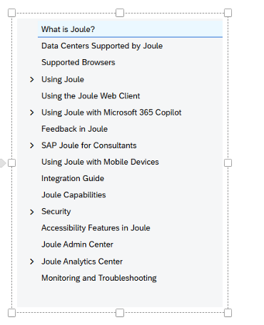

# What is Joule?

## Official Documentation

- https://help.sap.com/docs/joule/serviceguide/what-is-joule

---

## Overview

- Joule is the AI copilot that truly understands your business.
  - As a developer you develop an assistant and make it capable of doing different types of tasks by creating capabilities for it.

- Provided as a BTP service — runs in SAP BTP Cloud Foundry.

- Joule is a multi-tenant application.
  - Different consumers (tenants) are independently provisioned.
  - Data from consumers is isolated inside Joule.

- Automatically updated whenever:
  - capabilities are added
  - capabilities are changed

- Joule integrates with Microsoft 365 Copilot.
  - Joule capabilities can be leveraged directly from Microsoft 365 Copilot Business Chat and vice versa.

---

## Microsoft 365 Copilot Integration

- https://help.sap.com/docs/joule/serviceguide/using-joule-with-microsoft-365-copilot

---

# In Simple Terms

> An AI copilot is an assistant that helps you do work while you are doing it.

### Simple Analogy

- Pilot flies the plane
- Copilot assists
- YOU are still in control

---

## In Software/Developer World

An AI copilot:

- suggests code
- explains errors
- automates repetitive tasks
- helps think through problems

while you work.

---

# Joule Documentation overview

---

# Summary

- A AI copilot, understands your business
  - An assistant that helps you do work while you are doing it, like a co pilot in plane
  - So for developer it suggests/explain code , automates repetitive tasks, think through problem.
- As a developer you develop an assistant and make it capable of doing different types of tasks by creating capabilities for it.
- Provided as a BTP service — runs in SAP BTP Cloud Foundry.
- Is a multi-tenant application.
- Joule integrates with Microsoft 365 Copilot.

