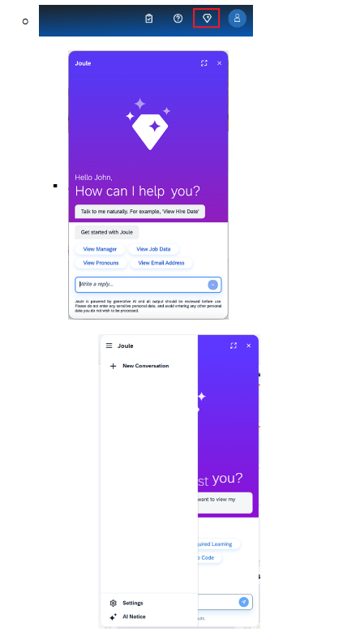

# Using Joule In-App

## Official Documentation

https://help.sap.com/docs/joule/serviceguide/using-joule

  

---

# 1. Opening Joule

Joule can be opened using:

- **Built-in launcher**
  - Floating button at the bottom-right of the screen

 

- **Custom launch option**
  - Implemented by integrating web platform

 

### Example

SAP S/4HANA Fiori Launchpad provides a built-in Joule button in toolbar.

  

---

# 2. After Opening Joule

User can:

- Trigger conversation
- Enter request in input field
- Press `Enter`
- Click `Send`

 

> Check [`joule_key_feature`](https://github.com/srish22/Learnings/blob/main/Joule/2.2_key-features.md) section for more details.

  

---

## Once Opened

| Available Features |
| :--- |
| - Side menu panel actions  - Close Joule anytime  - Expanded mode for larger interaction space  - Settings icon available in side panel |

  

---

## Main Actions Available

| Actions |
| :--- |
| - Disable streaming  - Add new conversation  - View active threads  - View expired conversations  - Rename conversations |

  

---

# 3. Managing Conversations

| Conversation Features | Limits & Expiration |
| :--- | :--- |
| - Create multiple conversations  - Rename conversations  - Delete conversations | - Max active conversations → `10`  - Conversations expire after `8 hours` inactivity  - User notified after expiration  - Expired conversations accessible for `7 days` |

  

---

# 6. UI Reference

  

---

# Summary

- Joule is embedded directly into SAP applications 
- Can be opened using :
  - Built-in launcher (Floating button at the bottom-right of the screen)
  - Custom launch option (Implemented by integrating platform)
- User can create multiple conversations and rename them (at a time only 10)
  - Conversations expire after - 8 hours of inactivity (user is notified)
  - Expired conversation can be accessed within 7 days|

